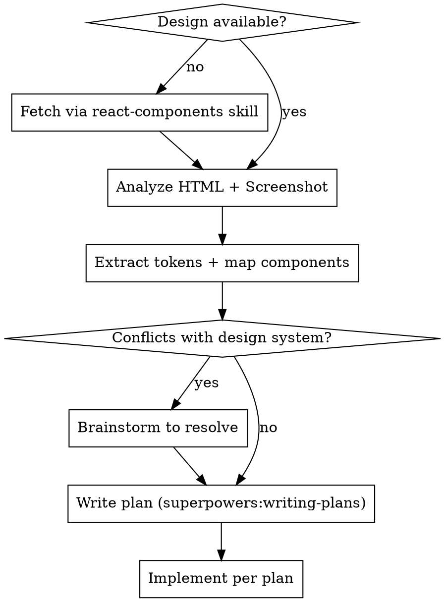

# Implementing Stitch Designs

Convert Stitch HTML mockups into production React components. **Analyze thoroughly before coding** — extract tokens, map components, resolve conflicts, then plan.

## Process

### Step 1: Ensure Design Files

Check `.stitch/designs/{name}.html` and `.png`. If missing, use `react-components` skill (Stitch MCP → `fetch-stitch.sh`). If present, ask user whether to refresh.

### Step 2: Analyze Design

Read HTML + view screenshot. Produce structured analysis:

- **Layout:** pattern (full-width/sidebar/inspector), grid structure, gaps
- **Token mapping:** Cross-reference EVERY color, spacing, font, radius against `docs/design/design-system.md`. Flag mismatches.
- **Component mapping:** Map each UI element to `docs/design/components.md` catalog. Mark new components as **[NEW]**.
- **Reusable vs screen-specific:** UI library (`packages/ui/`) vs screen components vs hooks

### Step 3: Resolve Conflicts

Stitch designs always have these conflicts — resolve before coding:
- Material Symbols icons → Lucide React
- Arbitrary hex colors → CSS variables (`var(--accent)`, etc.)
- CDN Tailwind config → project Tailwind v4 + design system tokens
- Inline styles → utility classes

**Design system is source of truth.** Use `superpowers:brainstorming` for ambiguous cases.

### Step 4: Check Page Design Doc

Per design system rules: check `docs/design/pages/{name}.md`. If exists, it's the primary spec (Stitch = visual ref). If not, create it using `feature-design` skill.

### Step 5: Write Implementation Plan

**REQUIRED:** Use `superpowers:writing-plans`. Plan must include:
1. Component tree (hierarchical breakdown)
2. Token mapping table (design token → CSS variable)
3. Component mapping (element → existing/new component)
4. File list (create/modify)
5. Missing shadcn/ui components to install
6. Data/state requirements (props, stores, queries)

### Step 6: Implement

Follow plan. Use `vercel-react-best-practices`:
- Modular components, no monoliths
- `Readonly<Props>` TypeScript interfaces
- Design system CSS variables only
- Lucide React icons, `cursor-pointer`, 150ms transitions

## Quick Reference

| Stitch | Project |
|--------|---------|
| Material Symbols | Lucide React (`lucide-react`) |
| `tailwind.config` in `<head>` | `docs/design/design-system.md` |
| Hardcoded hex | CSS variables (`--accent`, `--surface`) |
| `bg-[#252526]` | `bg-surface` |
| `rounded-lg` (CDN) | Design system radius table |

## Red Flags — STOP

- Writing JSX before token extraction → finish analysis first
- Hex values instead of CSS variables → map to design system
- 200+ line component → decompose
- No plan for multi-component screen → write plan first
- Ignoring Stitch/design-system conflicts → resolve with user
