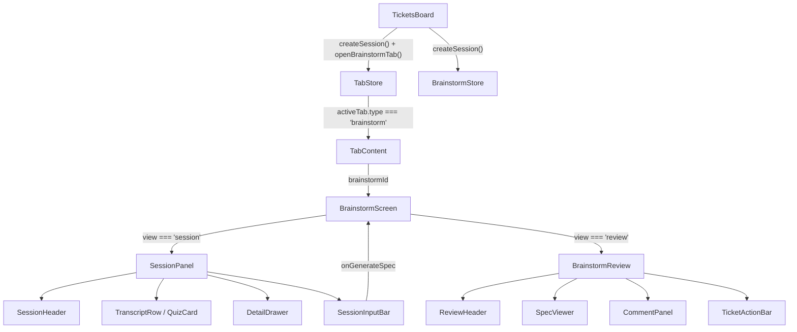

# Brainstorm + Session Flow

## Overview

The brainstorm feature lets users create AI-assisted brainstorming sessions that produce structured feature specifications. Each session has two views: a **Session view** (agent transcript with tool calls, quizzes, etc.) and a **Review view** (generated spec with comments and ticket drafting).

**Language:** TypeScript, React
**State:** Zustand (non-persisted for brainstorm, persisted for tabs)
**Status:** UI mockup phase — uses mock data for design review

## User Flow

1. User clicks **Brainstorm** button on TicketsBoard toolbar
2. A new `BrainstormSession` is created in the store, a tab opens
3. **Session view** shows the agent transcript (tool calls, thinking, quizzes, subagents, etc.)
4. User clicks **Generate Spec** button in the input bar
5. Store populates spec + comments from mock data, switches view to `'review'`
6. Tab label updates to the spec title
7. **Review view** shows the spec (left 60%) and comments panel (right 40%)
8. User can click **Revise** to go back to session view, or draft a ticket

## Architecture



## Key Files

### Screens & Routing

| File | Purpose |
|------|---------|
| `components/tab-content.tsx` | Routes active tab → screen. `'brainstorm'` → `BrainstormScreen` |
| `screens/brainstorm.tsx` | Orchestrator: selects session/review view, handles generateSpec + tab label update, auto-closes stale tabs via `useEffect` |
| `screens/project/tickets-board.tsx` | Entry point: Brainstorm button calls `createSession()` + `openBrainstormTab()` |

### Session View Components (`components/session/`)

| File | Purpose |
|------|---------|
| `types.ts` | `TranscriptEntry` (10 kinds), `SessionData`, `SessionPanelConfig` (incl. `onGenerateSpec`) |
| `session-view.tsx` | `SessionPanel` — transcript list (left), detail drawer (right 40%), input bar. Re-exports types |
| `transcript-row.tsx` | Single transcript item row with tool icon, color, label, badges (exit code, subagent status, task dots) |
| `detail-drawer.tsx` | Expanded view of selected transcript item. Uses `CodeBlock` (Shiki) for tool_call output with auto language detection |
| `session-input-bar.tsx` | Text input + send button + optional **Generate Spec** button (Sparkles icon) + Auto badge |
| `session-header.tsx` | Session title, status, duration, token count, cost, back/stop/pause buttons |
| `quiz-card.tsx` | Renders `quiz` entries as interactive cards (single/multi select) |

### Review View Components (`components/brainstorm-review/`)

| File | Purpose |
|------|---------|
| `review-layout.tsx` | `BrainstormReview` — ReviewHeader + SpecViewer (60%) + CommentPanel (40%) + TicketActionBar |
| `review-header.tsx` | Header with Revise and Create Ticket buttons |
| `spec-viewer.tsx` | Renders `BrainstormSpec` sections (problem, solution, requirements, acceptance criteria, technical notes) |
| `comment-panel.tsx` | Displays/adds/removes `SpecComment` entries per section |
| `ticket-action-bar.tsx` | Draft ticket bar with title, type, priority fields + discard/create buttons |

### Stores

| File | Purpose |
|------|---------|
| `stores/use-brainstorm-store.ts` | Zustand store (non-persisted). Sessions map, CRUD actions, `generateSpec`, `updateTitle`. Contains `MOCK_SPEC`, `MOCK_COMMENTS`, `MOCK_SESSION_DATA` |
| `stores/use-tab-store.ts` | Zustand store (persisted). Per-project tabs, `openBrainstormTab`, `updateTabLabel` (supports brainstorm type), `closeTab` |

### Types

| File | Purpose |
|------|---------|
| `types/tabs.ts` | `BrainstormTab` type: `{ id, type: 'brainstorm', projectId, brainstormId, label }` |

### UI Library

| File | Purpose |
|------|---------|
| `packages/ui/src/components/code-block.tsx` | `CodeBlock` — Shiki syntax highlighting, auto dark/light via `MutationObserver` on `html.dark`, supports 11 languages |

## Data Model

### BrainstormSession

```typescript
interface BrainstormSession {
  id: string              // "brainstorm-{timestamp}"
  projectId: string
  title: string           // "New Brainstorm" → updated to spec title
  view: 'session' | 'review'
  sessionData: SessionData  // transcript items
  spec: BrainstormSpec | null
  comments: SpecComment[]
  ticketDraft: TicketDraft
  createdAt: string
}
```

### TranscriptEntry (10 kinds)

| Kind | Key Fields | Rendered By |
|------|-----------|-------------|
| `user` | `content` | TranscriptRow (highlighted bg) |
| `thinking` | `summary` | TranscriptRow (italic, mono) |
| `tool_call` | `tool`, `input`, `output`, `status`, `label`, `detail` | TranscriptRow + DetailDrawer (CodeBlock) |
| `subagent` | `description`, `status`, `children: TranscriptItem[]` | TranscriptRow + indented children |
| `plan` | `summary`, `stepCount` | TranscriptRow |
| `tasks` | `items: {label, done}[]` | TranscriptRow (progress dots) |
| `response` | `content` | TranscriptRow |
| `quiz` | `question`, `mode`, `options`, `selectedIds` | QuizCard (inline, not in TranscriptRow) |
| `skill` | `name`, `content` | TranscriptRow |
| `error` | `message`, `stack` | TranscriptRow (red) + DetailDrawer (CodeBlock) |

### Tab ID Convention

- Session ID: `brainstorm-{Date.now()}`
- Tab ID: `brainstorm-{sessionId}` → results in `brainstorm-brainstorm-{timestamp}` (double prefix, pre-existing pattern)

## Store Actions

### BrainstormStore

| Action | Signature | Notes |
|--------|-----------|-------|
| `createSession` | `(projectId) => string` | Returns new session ID, populates with MOCK_SESSION_DATA |
| `generateSpec` | `(sessionId) => void` | Sets spec=MOCK_SPEC, comments=MOCK_COMMENTS, view='review' |
| `updateTitle` | `(sessionId, title) => void` | Updates session title (not yet called anywhere) |
| `setView` | `(sessionId, view) => void` | Toggle between 'session' and 'review' |
| `addComment` | `(sessionId, comment) => void` | Add to session's comments array |
| `removeComment` | `(sessionId, commentId) => void` | Remove from session's comments |
| `updateTicketDraft` | `(sessionId, draft) => void` | Partial update of ticketDraft |

### TabStore (brainstorm-relevant)

| Action | Notes |
|--------|-------|
| `openBrainstormTab(projectId, brainstormId, label)` | Creates tab, sets active. Dedupes by tab ID |
| `updateTabLabel(projectId, tabId, label)` | Supports `'ticket'` and `'brainstorm'` types |
| `closeTab(projectId, tabId)` | Used by BrainstormScreen to auto-close stale tabs |

## Edge Cases & Safety

- **Stale tabs from localStorage:** BrainstormScreen auto-closes tabs via `useEffect` when session not found in store (brainstorm store is non-persisted, tab store is persisted)
- **Tab bar visibility:** `tabToBarTab()` in `app-layout.tsx` handles `'brainstorm'` case to show tabs in header bar
- **onBack conditional:** Only shows back arrow when `session.spec` exists (can't navigate to empty review)

## Mock Data Coverage

The `MOCK_SESSION_DATA` covers all 10 transcript entry types for UI design review:
- user, thinking, skill, plan, tasks
- tool_call: Glob, Read (×2), Grep, Edit, Bash (error status)
- subagent (×2): parallel children with Read/Glob/Grep/Bash
- error (with stack trace)
- quiz: single-select + multi-select
- response (with markdown)

## Dependencies

```
BrainstormScreen
├── useBrainstormStore (zustand)
├── useTabStore (zustand, persisted)
├── SessionPanel
│   ├── SessionHeader
│   ├── TranscriptRow (×N)
│   ├── QuizCard (for quiz entries)
│   ├── DetailDrawer → CodeBlock (shiki)
│   └── SessionInputBar (onGenerateSpec)
└── BrainstormReview
    ├── ReviewHeader
    ├── SpecViewer
    ├── CommentPanel
    └── TicketActionBar
```

## Additional Insights

- **No backend integration yet** — all data is in-memory Zustand. `createSession` and `generateSpec` use mock data
- **`updateTitle` is dead code** — added to store interface but no consumer calls it yet
- **CodeBlock uses Shiki** with single-theme approach (detects dark mode via MutationObserver on `html.dark` class) to avoid CSS variable issues with dual themes
- **Detail drawer language detection** extracts file extension from tool_call input string to pick Shiki language

## Metadata

- **Date:** 2026-03-13
- **Depth:** Full feature (screens → components → stores → types)
- **Files touched:** 16 files analyzed
- **Feature status:** UI mockup with mock data for design review

## Next Steps

- Connect to real backend API for session creation and agent orchestration
- Replace mock data with real agent transcript streaming
- Implement spec generation via actual LLM call
- Add ticket creation flow (currently `onCreateTicket` is a no-op)
- Consider renaming session IDs to avoid double `brainstorm-brainstorm-` prefix
